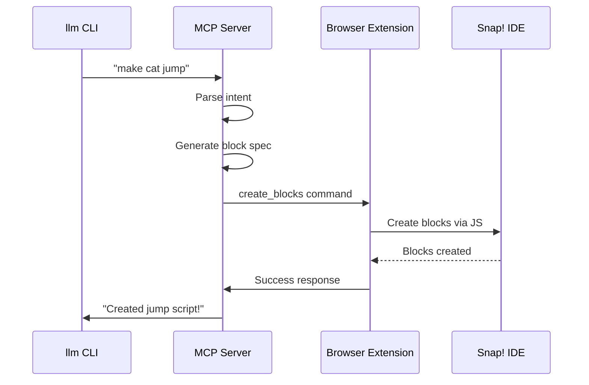
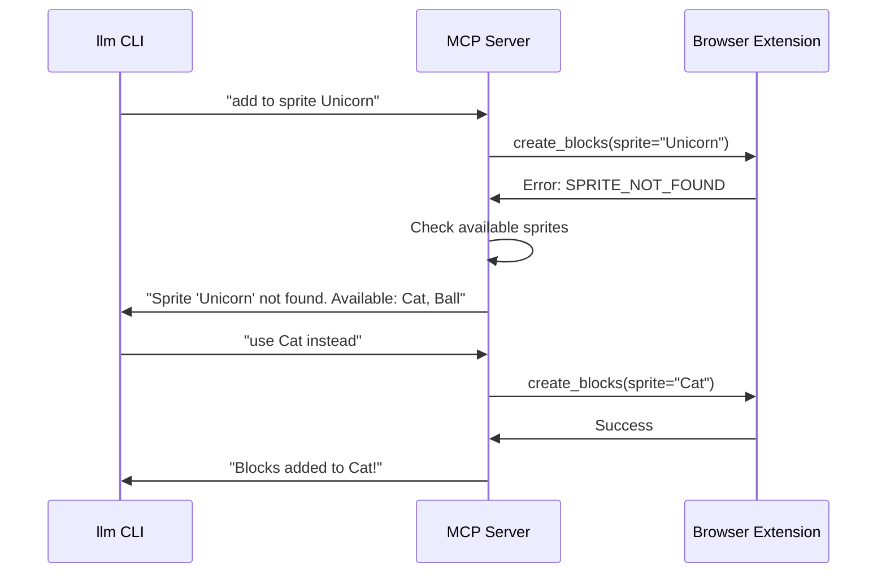

# WebSocket Protocol Specification - Snap! Bridge Communication

## Overview

Secure, bidirectional communication protocol between MCP Server and Snap Bridge (Browser Extension) enabling real-time block creation and project manipulation.

---

## Security Architecture

### Token-Based Authentication

```
┌─────────────┐                    ┌─────────────┐                    ┌─────────────┐
│   llm CLI   │                    │ MCP Server  │                    │   Browser   │
│             │                    │             │                    │  Extension  │
└──────┬──────┘                    └──────┬──────┘                    └──────┬──────┘
       │                                  │                                  │
       │ 1. Request session               │                                  │
       │─────────────────────────────────→│                                  │
       │                                  │                                  │
       │                                  │ 2. Generate one-time token       │
       │                                  │    (UUID + timestamp + HMAC)     │
       │                                  │                                  │
       │ 3. Return: {token, ws_url}       │                                  │
       │←─────────────────────────────────│                                  │
       │                                  │                                  │
       │ 4. Display token to user         │                                  │
       │    "Enter this code: ABC-123"    │                                  │
       │                                  │                                  │
       │                                  │                      5. User enters token
       │                                  │                         in extension UI
       │                                  │                                  │
       │                                  │ 6. Connect with token            │
       │                                  │←─────────────────────────────────│
       │                                  │                                  │
       │                                  │ 7. Validate token                │
       │                                  │    - Check HMAC                  │
       │                                  │    - Verify timestamp (<5 min)   │
       │                                  │    - Mark token as used          │
       │                                  │                                  │
       │                                  │ 8. Accept/Reject connection      │
       │                                  │─────────────────────────────────→│
       │                                  │                                  │
       │ 9. Start sending commands        │                                  │
       │─────────────────────────────────→│─────────────────────────────────→│
       │                                  │                                  │
```

### Token Structure

```json
{
  "token": "snap-mcp-a1b2c3d4-e5f6-7890-abcd-ef1234567890",
  "issued_at": "2025-09-30T10:30:00Z",
  "expires_at": "2025-09-30T10:35:00Z",
  "hmac": "8f7d6e5c4b3a2190",
  "session_id": "sess_xyz789",
  "permissions": ["create_blocks", "read_project", "execute_scripts"]
}
```

**Security Properties**:
- **One-time use**: Token invalid after successful connection
- **Time-limited**: 5-minute expiration window
- **HMAC-signed**: Prevents forgery
- **Permission-scoped**: Limits what can be done
- **Session-bound**: Ties to specific llm CLI session

---

## WebSocket Connection Lifecycle

### 1. Connection Establishment

**Client → Server** (Browser Extension initiates)
```json
{
  "type": "connect",
  "version": "1.0.0",
  "token": "snap-mcp-a1b2c3d4-e5f6-7890-abcd-ef1234567890",
  "client_info": {
    "extension_version": "0.1.0",
    "browser": "Chrome/120.0.0",
    "snap_version": "9.2.0",
    "user_agent": "Mozilla/5.0..."
  }
}
```

**Server → Client** (MCP Server responds)
```json
{
  "type": "connect_ack",
  "status": "accepted",
  "session_id": "sess_xyz789",
  "server_capabilities": {
    "max_message_size": 1048576,
    "supported_commands": ["create_blocks", "read_project", "execute_script", "inspect_state"],
    "protocol_version": "1.0.0"
  },
  "keep_alive_interval": 30000
}
```

**Error Response**
```json
{
  "type": "connect_error",
  "status": "rejected",
  "error": {
    "code": "INVALID_TOKEN",
    "message": "Token has expired or already been used",
    "retry_allowed": true,
    "new_token_url": "http://localhost:8765/new-token"
  }
}
```

### 2. Keep-Alive (Heartbeat)

**Every 30 seconds** (configurable)
```json
{
  "type": "ping",
  "timestamp": "2025-09-30T10:31:00Z"
}
```

**Response**
```json
{
  "type": "pong",
  "timestamp": "2025-09-30T10:31:00.123Z",
  "latency_ms": 123
}
```

### 3. Graceful Disconnection

**Client → Server**
```json
{
  "type": "disconnect",
  "reason": "user_closed_tab",
  "save_state": true
}
```

**Server → Client**
```json
{
  "type": "disconnect_ack",
  "state_saved": true,
  "reconnect_token": "reconnect-token-12345",
  "valid_until": "2025-09-30T11:00:00Z"
}
```

---

## Command Message Formats

### Base Message Structure

Every message follows this structure:
```json
{
  "message_id": "msg_001",           // Unique ID for tracking
  "type": "command",                 // Message type
  "timestamp": "2025-09-30T10:32:00Z",
  "session_id": "sess_xyz789",       // From connection
  "command": "create_blocks",        // Specific command
  "payload": { /* command-specific data */ },
  "options": {
    "timeout_ms": 5000,
    "retry_on_failure": false,
    "require_confirmation": false
  }
}
```

---

## Command Types

### 1. CREATE_BLOCKS

**Purpose**: Create Snap! blocks and scripts in the IDE

**MCP Server → Browser Extension**
```json
{
  "message_id": "msg_001",
  "type": "command",
  "command": "create_blocks",
  "payload": {
    "target_sprite": "Sprite",
    "scripts": [
      {
        "script_id": "script_001",
        "position": {"x": 50, "y": 50},
        "blocks": [
          {
            "block_id": "block_001",
            "opcode": "receiveKey",
            "category": "events",
            "inputs": {
              "KEY": "space"
            },
            "is_hat_block": true,
            "next": "block_002"
          },
          {
            "block_id": "block_002",
            "opcode": "changeYBy",
            "category": "motion",
            "inputs": {
              "DY": 50
            },
            "next": "block_003"
          },
          {
            "block_id": "block_003",
            "opcode": "doWait",
            "category": "control",
            "inputs": {
              "DURATION": 0.3
            },
            "next": "block_004"
          },
          {
            "block_id": "block_004",
            "opcode": "changeYBy",
            "category": "motion",
            "inputs": {
              "DY": -50
            },
            "next": null
          }
        ]
      }
    ],
    "visual_feedback": {
      "animate_creation": true,
      "highlight_duration_ms": 2000,
      "show_explanation": true,
      "explanation_text": "When you press space, the sprite jumps up and comes back down!"
    }
  },
  "options": {
    "timeout_ms": 5000,
    "rollback_on_error": true
  }
}
```

**Browser Extension → MCP Server** (Success)
```json
{
  "message_id": "msg_001",
  "type": "response",
  "status": "success",
  "payload": {
    "blocks_created": 4,
    "scripts_created": 1,
    "execution_time_ms": 234,
    "created_block_ids": ["block_001", "block_002", "block_003", "block_004"],
    "sprite_info": {
      "name": "Sprite",
      "position": {"x": 0, "y": 0},
      "total_scripts": 3
    }
  }
}
```

**Browser Extension → MCP Server** (Error)
```json
{
  "message_id": "msg_001",
  "type": "response",
  "status": "error",
  "error": {
    "code": "SPRITE_NOT_FOUND",
    "message": "Sprite 'Sprite' does not exist in current project",
    "details": {
      "available_sprites": ["Stage", "Cat", "Ball"],
      "attempted_sprite": "Sprite"
    },
    "recovery_suggestions": [
      "Create a new sprite named 'Sprite'",
      "Use one of the existing sprites"
    ]
  }
}
```

---

### 2. READ_PROJECT

**Purpose**: Inspect current Snap! project state

**MCP Server → Browser Extension**
```json
{
  "message_id": "msg_002",
  "type": "command",
  "command": "read_project",
  "payload": {
    "include": {
      "sprites": true,
      "scripts": true,
      "variables": true,
      "custom_blocks": true,
      "stage": true
    },
    "detail_level": "summary"  // "summary", "detailed", "full"
  }
}
```

**Browser Extension → MCP Server**
```json
{
  "message_id": "msg_002",
  "type": "response",
  "status": "success",
  "payload": {
    "project": {
      "name": "My Jumping Game",
      "sprites": [
        {
          "name": "Sprite",
          "costume_count": 2,
          "script_count": 3,
          "position": {"x": 0, "y": 0},
          "size": 100,
          "visible": true
        }
      ],
      "stage": {
        "costume_count": 1,
        "script_count": 1
      },
      "global_variables": ["score", "level"],
      "custom_blocks": ["jump with sound", "reset game"]
    }
  }
}
```

---

### 3. EXECUTE_SCRIPT

**Purpose**: Execute JavaScript code in Snap! context

**MCP Server → Browser Extension**
```json
{
  "message_id": "msg_003",
  "type": "command",
  "command": "execute_script",
  "payload": {
    "javascript_code": "ide.currentSprite.gotoXY(0, 0); ide.currentSprite.show();",
    "return_result": true,
    "sandbox_mode": true  // Execute in isolated context
  },
  "options": {
    "timeout_ms": 3000
  }
}
```

**Browser Extension → MCP Server**
```json
{
  "message_id": "msg_003",
  "type": "response",
  "status": "success",
  "payload": {
    "result": null,
    "execution_time_ms": 45,
    "side_effects": {
      "sprite_moved": true,
      "sprite_shown": true
    }
  }
}
```

---

### 4. INSPECT_STATE

**Purpose**: Get specific information about Snap! IDE state

**MCP Server → Browser Extension**
```json
{
  "message_id": "msg_004",
  "type": "command",
  "command": "inspect_state",
  "payload": {
    "query": {
      "type": "blocks_at_position",
      "sprite": "Sprite",
      "x": 50,
      "y": 50,
      "radius": 100
    }
  }
}
```

**Browser Extension → MCP Server**
```json
{
  "message_id": "msg_004",
  "type": "response",
  "status": "success",
  "payload": {
    "blocks_found": [
      {
        "block_id": "block_001",
        "opcode": "receiveKey",
        "position": {"x": 50, "y": 50},
        "connected_blocks": 3
      }
    ],
    "total_count": 1
  }
}
```

---

### 5. DELETE_BLOCKS

**Purpose**: Remove specific blocks or scripts

**MCP Server → Browser Extension**
```json
{
  "message_id": "msg_005",
  "type": "command",
  "command": "delete_blocks",
  "payload": {
    "target_sprite": "Sprite",
    "selection": {
      "type": "by_id",  // "by_id", "by_position", "all_scripts"
      "block_ids": ["block_001", "block_002"]
    },
    "options": {
      "confirm_before_delete": false,
      "create_undo_snapshot": true
    }
  }
}
```

---

### 6. CREATE_CUSTOM_BLOCK

**Purpose**: Define and create custom Snap! blocks

**MCP Server → Browser Extension**
```json
{
  "message_id": "msg_006",
  "type": "command",
  "command": "create_custom_block",
  "payload": {
    "block_name": "jump with sound",
    "category": "motion",
    "parameters": [
      {
        "name": "height",
        "type": "number",
        "default": 50
      },
      {
        "name": "sound",
        "type": "sound",
        "default": "boing"
      }
    ],
    "definition": {
      "blocks": [
        {
          "opcode": "doPlaySound",
          "inputs": {"SOUND": "%sound"}
        },
        {
          "opcode": "changeYBy",
          "inputs": {"DY": "%height"}
        },
        {
          "opcode": "doWait",
          "inputs": {"DURATION": 0.3}
        },
        {
          "opcode": "changeYBy",
          "inputs": {"DY": {"operation": "multiply", "operands": ["%height", -1]}}
        }
      ]
    },
    "scope": "global"  // "global" or "sprite_only"
  }
}
```

---

### 7. HIGHLIGHT_BLOCKS

**Purpose**: Visual feedback - highlight specific blocks

**MCP Server → Browser Extension**
```json
{
  "message_id": "msg_007",
  "type": "command",
  "command": "highlight_blocks",
  "payload": {
    "block_ids": ["block_001", "block_002"],
    "highlight_style": {
      "color": "#FFD700",
      "duration_ms": 2000,
      "pulse": true
    },
    "show_tooltip": {
      "text": "These blocks make the sprite jump!",
      "position": "above"
    }
  }
}
```

---

### 8. EXPORT_PROJECT

**Purpose**: Export current Snap! project

**MCP Server → Browser Extension**
```json
{
  "message_id": "msg_008",
  "type": "command",
  "command": "export_project",
  "payload": {
    "format": "xml",  // "xml", "json", "blocks_only"
    "include_media": false,
    "compress": false
  }
}
```

**Browser Extension → MCP Server**
```json
{
  "message_id": "msg_008",
  "type": "response",
  "status": "success",
  "payload": {
    "project_data": "<project>...</project>",
    "size_bytes": 12345,
    "format": "xml"
  }
}
```

---

## Event Streaming (Server → Client)

### Unsolicited Events from Browser

**Purpose**: Browser extension notifies MCP server of events

```json
{
  "type": "event",
  "event_type": "user_action",
  "timestamp": "2025-09-30T10:35:00Z",
  "payload": {
    "action": "block_clicked",
    "block_id": "block_001",
    "sprite": "Sprite"
  }
}
```

**Event Types**:
- `user_action`: User interacted with Snap! IDE
- `block_executed`: A block was run
- `error_occurred`: Runtime error in Snap!
- `project_modified`: Project structure changed
- `sprite_created`: New sprite added

---

## Error Codes

### Connection Errors
- `INVALID_TOKEN`: Token validation failed
- `TOKEN_EXPIRED`: Token past expiration time
- `TOKEN_ALREADY_USED`: Token has been used before
- `VERSION_MISMATCH`: Protocol version incompatible
- `CONNECTION_LIMIT`: Too many active connections

### Command Errors
- `SPRITE_NOT_FOUND`: Target sprite doesn't exist
- `INVALID_BLOCK_SPEC`: Block specification malformed
- `EXECUTION_TIMEOUT`: Command took too long
- `PERMISSION_DENIED`: Command not allowed for session
- `SNAP_NOT_LOADED`: Snap! IDE not ready

### Runtime Errors
- `JAVASCRIPT_ERROR`: JS execution failed
- `MEMORY_LIMIT`: Operation too large
- `RATE_LIMIT`: Too many commands too quickly

---

## Performance Considerations

### Message Size Limits
```json
{
  "max_message_size_bytes": 1048576,  // 1MB
  "max_blocks_per_command": 100,
  "max_scripts_per_command": 10,
  "rate_limit": {
    "max_commands_per_minute": 60,
    "burst_allowance": 10
  }
}
```

### Batching Support

**Multiple commands in one message**
```json
{
  "message_id": "batch_001",
  "type": "batch_command",
  "commands": [
    {
      "command": "create_blocks",
      "payload": { /* ... */ }
    },
    {
      "command": "highlight_blocks", 
      "payload": { /* ... */ }
    }
  ],
  "options": {
    "execute_sequentially": true,
    "stop_on_error": false
  }
}
```

---

## Message Flow Examples

### Example 1: Simple Block Creation



### Example 2: Error Handling with Recovery



---

## Security Best Practices

### 1. Token Management
```python
# MCP Server
def generate_secure_token():
    """Generate cryptographically secure one-time token"""
    token_data = {
        "uuid": str(uuid.uuid4()),
        "issued_at": datetime.utcnow().isoformat(),
        "expires_at": (datetime.utcnow() + timedelta(minutes=5)).isoformat(),
        "session_id": generate_session_id(),
        "permissions": ["create_blocks", "read_project"]
    }
    
    # HMAC signature
    hmac_key = os.environ.get("SNAP_MCP_SECRET_KEY")
    signature = hmac.new(
        hmac_key.encode(),
        json.dumps(token_data).encode(),
        hashlib.sha256
    ).hexdigest()
    
    token_data["hmac"] = signature
    return token_data
```

### 2. Input Validation
```javascript
// Browser Extension
function validateCommand(command) {
    // Whitelist allowed commands
    const ALLOWED_COMMANDS = [
        'create_blocks', 'read_project', 'execute_script',
        'inspect_state', 'delete_blocks', 'create_custom_block'
    ];
    
    if (!ALLOWED_COMMANDS.includes(command.command)) {
        throw new SecurityError('Command not allowed');
    }
    
    // Validate payload structure
    validatePayloadSchema(command.payload);
    
    // Sanitize inputs
    sanitizeInputs(command.payload);
    
    return true;
}
```

### 3. Sandboxed Execution
```javascript
// Browser Extension
function executeJavaScriptSafely(code) {
    // Create isolated context
    const sandbox = {
        ide: limitedIdeAccess(),
        sprite: currentSpriteProxy(),
        // No access to: document, window, localStorage, etc.
    };
    
    // Execute with timeout
    const timeout = 3000;
    return runWithTimeout(code, sandbox, timeout);
}
```

This protocol specification ensures secure, efficient, and reliable communication between all components of the Snap! educational system.